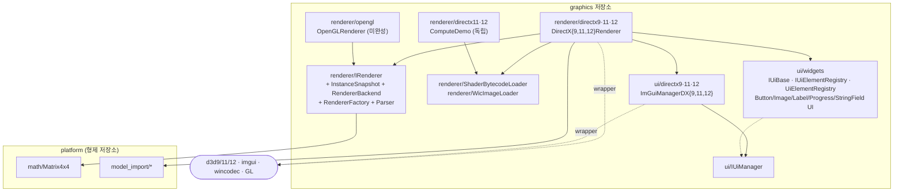
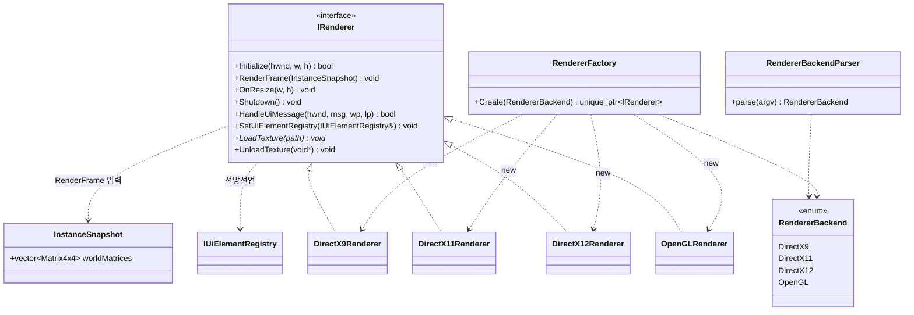
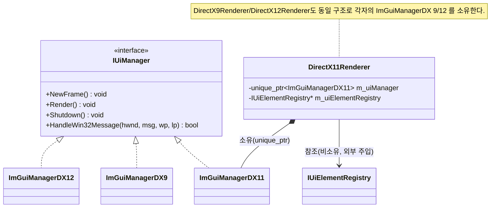
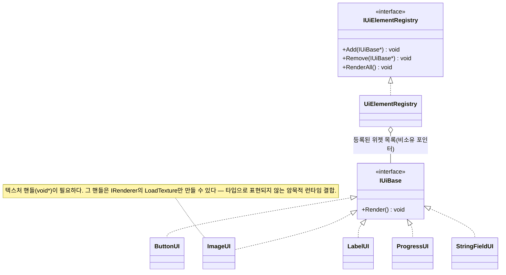
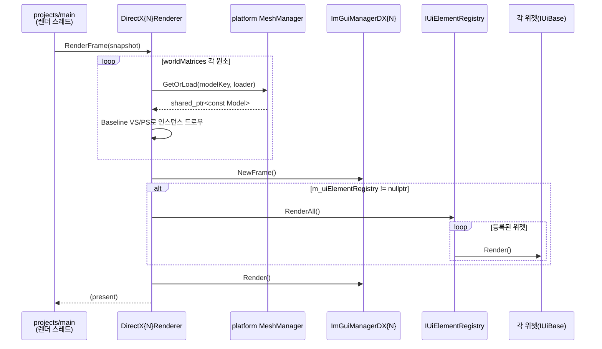

# 전체아키텍처 다이어그램 — graphics (2026-08-31 02:12)

`agent_harness/.claude/commands/diagram_delegation.md` 워크플로우로 생성한 첫 스냅샷.
이 문서는 영구 보관하며, 다음 실행은 이 파일을 덮어쓰지 않고 새 날짜 파일을 추가한다.

---

## Step 1 — 범위와 표현 계획

- 대상 범위: **전체 시스템** (`graphics` 저장소 전체).
- 뷰 집합: 표준 4개 뷰 전부.
- 뷰별 아트 티어:
  - 뷰 1 (모듈 맵): Mermaid flowchart.
  - 뷰 2 (클래스 & 연관도): Mermaid classDiagram — 인터페이스 3개 + 구현 다수, 상속/합성 관계 표기 필요.
  - 뷰 3 (생명주기 & 소유권): Mermaid stateDiagram + 소유권 요약.
  - 뷰 4 (런타임 / 데이터플로우): Mermaid sequenceDiagram — `RenderFrame` 한 프레임 흐름.
- 에스컬레이션: 전 뷰 Mermaid. 노드 최대 약 20개로 HTML 불필요. ASCII는 클래스 상속 표기 정렬 비용이 커서 미채택.

`graphics`는 DirectX/OpenGL 등 특정 그래픽스 API를 캡슐화하는 계층이다.
`projects`(WOT)를 몰라야 하고 `platform`에는 의존해도 된다.

---

## 뷰 1 — 시스템 / 모듈 맵

### 모델 목록

| 영역 | 주요 타입 | 의존 |
|---|---|---|
| `renderer` (공용) | IRenderer, InstanceSnapshot, RendererBackend(enum), RendererBackendParser, RendererFactory, ShaderBytecodeLoader, WicImageLoader | `platform/math`(InstanceSnapshot) |
| `renderer/directx9·11·12` | DirectX9/11/12Renderer (: IRenderer) | `ui/directxN`(ImGui 매니저 소유), `platform/model_import`, `ShaderBytecodeLoader`, `WicImageLoader`, `ui/widgets/IUiElementRegistry`, `<d3d9/11/12.h>` |
| `renderer/directx11·12` | DirectX11/12ComputeDemo | `ShaderBytecodeLoader` (IRenderer 경로 아님 — 독립 데모) |
| `renderer/opengl` | OpenGLRenderer (: IRenderer) | `IRenderer`만 (미완성 — 뷰 3 참조) |
| `ui` (공용) | IUiManager | (없음) |
| `ui/directx9·11·12` | ImGuiManagerDX9/11/12 (: IUiManager) | `<imgui.h>`, `<imgui_impl_dxN.h>`, `<imgui_impl_win32.h>` |
| `ui/widgets` | IUiBase, IUiElementRegistry, UiElementRegistry, ButtonUI, ImageUI, LabelUI, ProgressUI, StringFieldUI | `IUiBase`만 (백엔드·렌더러 무의존) |

- `graphics → platform` 의존은 `math/Matrix4x4`와 `model_import/{MeshManager, ModelLoader, RefCountingCachePolicy}` 두 갈래뿐이다.
- `renderer`가 `ui`에 의존한다 (각 `DirectXNRenderer`가 `ImGuiManagerDXN`을 멤버로 소유). 역방향은 없다.
- `ui/widgets`는 `renderer`/`ui`(매니저)와 완전히 분리되어 있다 — `IUiBase` 하나에만 의존.
- 외부 라이브러리(`d3dN`, `imgui`, `wincodec`)는 각 백엔드별 파일에만 갇혀 있다.

### 다이어그램



> `widgets -.-> IUiManager` 점선: 코드 의존이 아니라 런타임 협력(위젯은 ImGui 컨텍스트가 살아있는 동안에만 그려짐, 뷰 4 참조).

---

## 뷰 2 — 서브시스템 클래스 & 연관도

### 2-a. 렌더러 인터페이스와 백엔드



### 2-b. 렌더러와 UI 매니저의 소유 관계



### 2-c. UI 위젯 계층



---

## 뷰 3 — 객체 생명주기 & 소유권

### IRenderer 수명주기

```mermaid
stateDiagram-v2
    [*] --> Created : RendererFactory::Create(backend)
    Created --> Initialized : Initialize(hwnd, w, h)
    Initialized --> Initialized : SetUiElementRegistry(registry)
    Initialized --> Rendering : RenderFrame(snapshot)
    Rendering --> Rendering : RenderFrame(snapshot) 매 프레임
    Rendering --> Initialized : OnResize(w, h)
    Rendering --> Shutdown : Shutdown()
    Initialized --> Shutdown : Shutdown()
    Shutdown --> [*]
```

### 소유권 요약

```
호출자(projects/main) ──unique_ptr──> IRenderer(구현체)
IRenderer 구현체       ──unique_ptr──> ImGuiManagerDX{N}   (백엔드 짝, 내부 소유)
IRenderer 구현체       ──raw ptr(비소유)──> IUiElementRegistry  (외부에서 SetUiElementRegistry로 주입)
호출자(projects/main) ──소유──> UiElementRegistry + 각 위젯(Button/Image/…)
DirectX{N}Renderer   ──값/멤버──> platform MeshManager(RefCountingCachePolicy) — 모델 캐시
```

- 렌더러는 UI **매니저**(ImGui 배선)는 소유하지만, UI **위젯**(레지스트리·Button 등)은 소유하지 않는다.
- 위젯의 수명은 호출자(projects)가 관리하며, 렌더러에는 `IUiElementRegistry*`만 넘어간다.

---

## 뷰 4 — 런타임 / 데이터플로우

`RenderFrame(snapshot)` 한 번의 내부 흐름.

### 모델 목록

- 입력: `InstanceSnapshot`(= `vector<Matrix4x4> worldMatrices`), 외부에서 이미 채워진 상태.
- 3D 패스: 각 world matrix마다 `MeshManager`가 캐시한 Model을 Baseline VS/PS(`shaders/directxN/Baseline.{vs,ps}.cso`)로 인스턴싱 드로우.
- UI 패스: `m_uiManager->NewFrame()` → (등록돼 있으면) `m_uiElementRegistry->RenderAll()` → `m_uiManager->Render()`.
- 레지스트리가 `nullptr`이면 UI 패스에서 위젯 렌더는 생략된다.

### 다이어그램



- 입력 스레드 메시지: `Caller`가 Win32 메시지를 받으면 `R->HandleUiMessage(...)` → 내부에서 `UM->HandleWin32Message(...)`로 위임.
- `graphics`는 메인 루프를 소유하지 않는다 — 루프 오케스트레이션은 `projects`의 몫이며, 이 계층은 프레임 단위 계약(`RenderFrame`)만 제공한다.

---

## Step 3 — 다이어그램 기준 아키텍처 점검

### 일치성 검사

- 첫 스냅샷이라 직전 문서 diff 없음.
- 뷰 1~4의 노드/엣지는 include 그래프 + 헤더 선언 + 헤더 주석에서 도출했고, 코드와 불일치 없음.
- 최근 두 사이클(`UI위젯_렌더링계약`, `텍스처로딩API`)이 `docs/inbox`/`docs/outbox`의 WOT 요청 응답으로 추가한 API(위젯 5종, `LoadTexture`/`UnloadTexture`)가 뷰 2에 반영되어 있다.

### 적합성 리뷰 (심각도 등급)

- **[MEDIUM] `OpenGLRenderer`가 다른 백엔드와 비대칭이다 (사실상 스텁).**
  - `OpenGLRenderer.cpp`는 자기 헤더만 include한다 — `platform/model_import`, 셰이더 로더, UI 매니저 배선이 전부 없다.
  - `RendererBackend::OpenGL`은 argv로 선택 가능하지만 선택하면 DirectX 백엔드와 동등한 동작을 하지 않는다.
  - 다음 작업 후보: (a) OpenGL을 실제 구현하거나, (b) enum/팩토리에서 제외하고 "미지원"으로 명시하거나, (c) `experimental` 플래그 뒤로 숨김.

- **[MEDIUM] 렌더러 헤더가 구체 UI 매니저 타입에 의존한다.**
  - `DirectX11Renderer.h`가 `ImGuiManagerDX11.h`(구체 클래스)를 include하고 `unique_ptr<ImGuiManagerDX11>`을 멤버로 든다.
  - 그 결과 렌더러 헤더를 include하는 쪽이 ImGui 백엔드 헤더까지 전이적으로 끌어온다.
  - 다음 작업 후보: 멤버를 `unique_ptr<IUiManager>`로 바꾸고 생성 시점에 구체 타입 주입(팩토리/pImpl). 소멸자만 .cpp로 내리면 전방선언으로 충분.

- **[LOW] `IRenderer`의 텍스처 핸들이 `void*`다.**
  - `LoadTexture(path) -> void*` / `UnloadTexture(void*)`가 타입 안전성 없이 인터페이스를 넘나든다.
  - WOT의 `ImageUI` 요청에 맞춰 추가된 것(git log 확인). 불투명 핸들 타입(`struct TextureHandle { void* p; }` 수준)만 씌워도 오용이 준다.

- **[LOW] `ImageUI` ↔ 렌더러 사이에 타입으로 표현 안 된 런타임 계약.**
  - `ImageUI`는 텍스처 핸들이 필요하지만 그 핸들은 `IRenderer::LoadTexture`만 만든다.
  - 위젯 계층이 렌더러에 코드 의존하지 않는 것은 좋으나, "먼저 렌더러로 텍스처를 로드해 `void*`를 위젯에 넘겨야 한다"는 순서 계약이 문서/타입 어디에도 강제되지 않는다.

- **[LOW] `ComputeDemo` 클래스가 `renderer/` 안에 있으나 `IRenderer` 경로가 아니다.**
  - `DirectX11ComputeDemo`, `DirectX12ComputeDemo`는 독립 실행 데모다.
  - platform의 "소비되지 않는 collision 알고리즘"과 같은 성격(작은 규모). `renderer/demo/` 또는 `examples/`로 분리하면 IRenderer 경로가 깔끔해진다.

- **[없음] `ui/widgets`의 계층 분리는 양호하다.**
  - 위젯이 백엔드·렌더러·ImGui 매니저를 전혀 모른다. `IUiBase` 하나에만 의존.

### 워크스루 (읽기 경로)

1. `renderer/IRenderer.h`부터 — 9개 메서드가 이 계층의 전체 계약이다.
2. `renderer/InstanceSnapshot.h` — 필드가 `worldMatrices` 하나뿐. 이 단순함이 스레드 경계 설계의 핵심(WOT 뷰 4로 이어짐).
3. `renderer/RendererFactory.{h,cpp}` — argv → `RendererBackend` → 구체 렌더러. 진입 분기점.
4. `renderer/directx11/DirectX11Renderer.{h,cpp}` 하나만 정독 — 나머지 DX9/12는 같은 구조. 헤더 주석에 `RenderFrame` 내부 순서(3D → UI NewFrame → RenderAll → UI Render)가 적혀 있다.
5. `ui/IUiManager.h` → `ui/directx11/ImGuiManagerDX11.{h,cpp}` — ImGui + Win32 + DX11 배선이 여기 갇혀 있다.
6. `ui/widgets/` — `IUiBase.h` → `IUiElementRegistry.h` → `UiElementRegistry.cpp` → 개별 위젯. 렌더러와 독립이므로 마지막에 봐도 된다.

---

## 참고

- Step 3 발견 사항은 수정하지 않았다 — 각 항목은 별도 Task Delegation 사이클 후보다.
- 다음 스냅샷과 diff하면 백엔드 추가/계약 변경/의존 방향 변화가 드러난다.
